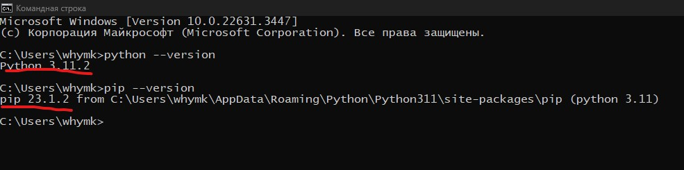
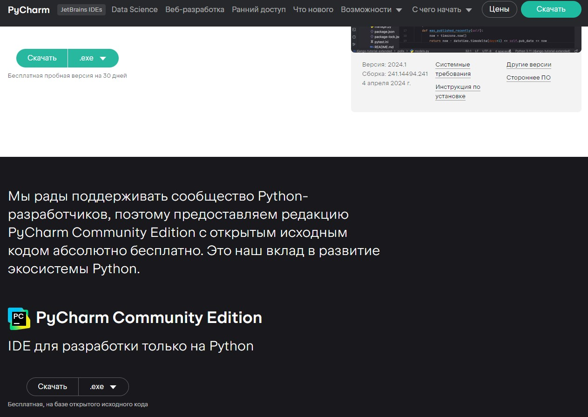

# Python.
# Первый урок.

План на урок:
1. Установка Python. Установка PyCharm
2. Переменные, операторы.
3. Функции print и input.
4. Типы данных.
5. Структуры данных.
6. Списки и операции над ними.
7. Методы списков.

## 1. Установка Python и PyCharm
## Установка Python.
### Для установки Python на Windows вам понадобятся следующие шаги:

1. Загрузка установщика Python
Перейдите на официальный сайт Python и скачайте установщик Python для Windows.
Официальный сайт Python: https://www.python.org/downloads/

2. Запуск установщика.
Запустите загруженный установщик Python и следуйте инструкциям на экране. 
Убедитесь, что вы выбрали опцию **"Add Python to PATH"** во время установки, чтобы Python был доступен из командной строки.

3. Проверка установки.
После завершения установки откройте командную строку и введите команду python --version, чтобы убедиться, что Python успешно установлен.


## Установка PyCharm
### Для установки PyCharm на Windows на вашем компьютере, выполните следующие шаги:

1. Перейдите на официальный сайт PyCharm от JetBrains.
Официальный сайт PyCharm от JetBrains: https://www.jetbrains.com/ru-ru/pycharm/download/?section=windows
2. Скачайте последнюю версию PyCharm Community Edition для Windows.

3. Запустите загруженный установщик PyCharm.
4. Следуйте инструкциям на экране, чтобы завершить установку. 
Убедитесь, что вы выбрали правильную версию **PyCharm (Community Edition или Professional)** в соответствии с вашими потребностями.
5. После завершения установки, запустите PyCharm.

## 2. Переменные, операторы.
### Переменные
**Переменные** в Python - это именованные **места в памяти**, которые используются для хранения данных. Каждая переменная имеет **имя**, которое вы можете выбрать, и **значение**, которое может быть любым объектом в Python, таким как число, строка, список и т. д.

Чтобы создать переменную в Python, вы должны присвоить ей **имя** и **значение**. Например, вы можете создать переменную с именем **x** и присвоить ей значение **10**, используя следующий синтаксис:
```python
x = 10
```
Теперь переменная x содержит значение 10. Вы можете использовать эту переменную в вашем коде, например, для выполнения математических операций или вывода значения на экран.
```python
y = x + 5
print(y)  # Выводит: 15
```
Вы также можете изменять **значение переменной**, присваивая ей новое значение:
```python
x = 20
print(x)  # Выводит: 20
```
Примечание: В Python существуют некоторые правила и рекомендации для именования переменных. Например, **имена** переменных могут содержать **только буквы**, **цифры** и **символ подчеркивания**, и **не могут начинаться** с **цифры**. Также регистр букв имеет значение, поэтому переменные x и X будут считаться разными переменными.

### Операторы
**Операторы** в Python - это **символы** или **ключевые слова**, которые выполняют **операции** над значениями, такими как переменные. Они позволяют вам выполнять математические операции, сравнивать значения, присваивать значения переменным и многое другое.

Операторы в Python могут быть использованы для выполнения различных операций, включая:

1. Математические операции, такие как сложение (+), вычитание (-), умножение (*), деление (/).
2. Операции сравнения, такие как равно (==), не равно (!=), больше (>), меньше (<), больше или равно (>=), меньше или равно (<=).
3. Логические операции, такие как логическое И (and), логическое ИЛИ (or), логическое НЕ (not).
4. Операции присваивания, такие как присваивание значения переменной (=), присваивание с добавлением (+=), присваивание с вычитанием (-=).

**Операторы позволяют вам создавать выражения, которые манипулируют значениями переменных и выполняют различные действия в вашей программе.**

Например, вы можете использовать операторы для выполнения математических операций:
```python
x = 5
y = 3
sum = x + y  # Сложение
difference = x - y  # Вычитание
product = x * y  # Умножение
quotient = x / y  # Деление
```
Также вы можете использовать операторы сравнения для сравнения значений переменных:
```python
a = 10
b = 5
greater_than = a > b  # Больше ли a, чем b?
less_than_or_equal = a <= b  # Меньше или равно ли a b?
equal_to = a == b  # Равны ли a и b?
not_equal = a != b  # Не равны ли a и b?
```
**Операторы в Python позволяют вам выполнять различные операции и манипулировать значениями переменных в вашей программе.**

## 3. Функции print и input.
### print
Функция **print()** в Python используется для вывода текста или значений переменных на экран или в другой выходной поток. Она является одной из встроенных функций в Python и имеет следующий синтаксис:
```python
print(значение1, значение2, ..., sep=разделитель, end=окончание)
```
Где:
1. значение1, значение2, ... - это значения, которые вы хотите вывести на экран. Вы можете передавать одно или несколько значений через запятую.
2. sep (необязательный параметр) - это разделитель, который будет использоваться между значениями. По умолчанию разделителем является пробел.
3. end (необязательный параметр) - это окончание, которое будет добавлено после вывода всех значений. По умолчанию окончанием является символ новой строки (\n).
```python
x = 5
y = 3
sum = x + y  # Сложение
print(sum)
difference = x - y  # Вычитание
print(sum, difference, sep="_")
product = x * y  # Умножение
print(product, end="/n")
quotient = x / y  # Деление
print(quotient, end="/n")
```
Функция print() является полезным инструментом для **отладки**, **вывода результатов** и **взаимодействия с пользователем** в Python.

### input
Функция input() в Python используется для получения ввода от пользователя. Она позволяет программе ожидать ввода данных от пользователя и сохранять его в переменную.

Синтаксис функции input() выглядит следующим образом:
```python
переменная = input("Сообщение для пользователя: ")
```
Где:
1. переменная - это переменная, в которую будет сохранен ввод пользователя.
2. "Сообщение для пользователя" (необязательный параметр) - это текст, который будет отображаться для пользователя перед ожиданием ввода. Он может быть любой строкой или пустым.
```python
x = input("Введите переменную x: ")
y = input("Введите переменную y: ")
sum = x + y  # Сложение
difference = x - y  # Вычитание
product = x * y  # Умножение
quotient = x / y  # Деление
```
## Задание:
1. Создайте переменную x и присвойте ей значение 5. Выведите значение переменной на экран.
2. Создайте переменные a и b и присвойте им значения 10 и 20 соответственно. Вычислите сумму этих переменных и выведите результат на экран.
3. Создайте переменные first_num и second_num. Присвойте им значения с помощью input. Найдите сумму, разницу, умножение и деление этих чисел.

## 4. Типы данных.

**Типы данных** в Python определяют характеристики и поведение значений, которые могут быть сохранены в переменных. Python предоставляет различные встроенные типы данных, которые могут использоваться для хранения разных видов информации.

Вот некоторые из основных типов данных в Python:
1. Числовые типы данных: Включают целые числа (int), числа с плавающей точкой (float) и комплексные числа (complex). Целые числа представляют целочисленные значения, числа с плавающей точкой представляют числа с десятичной точкой, а комплексные числа представляются в виде a + bj, где a и b - это числа.
```python
int_number = 5 #целое число
float_number = 10.3 #число с плавающей точкой
print("целое число: ", int_number, "\n", "число с плавающей точкой: ", float_number)
```
2. Строковый тип данных: Строки (str) используются для хранения текстовой информации. Строки в Python могут быть заключены в одинарные (') или двойные кавычки (").
```python
name = "John"  # строка
message = 'Привет, мир!'  # строка
print(name, " : ", message)
```
3. Булевый тип данных (boolean) в Python представляет логические значения True (истина) и False (ложь). Он используется для выполнения логических операций и принятия решений в программе. Булевый тип данных также может быть результатом логических операций, таких как сравнения (>, <, ==, и т.д.) и логических операторов (and, or, not).
```python
x = True
y = False
print(x)  # Выводит: True
print(y)  # Выводит: False

a = 10
b = 5
print(a > b)  # Выводит: True, так как a больше b
print(a == b)  # Выводит: False, так как a не равно b
```
4. Списки: Списки (list) представляют упорядоченные коллекции элементов, которые могут быть разных типов данных. Элементы списка разделяются запятыми и заключаются в квадратные скобки ([]).
```python
numbers = [1, 2, 3, 4, 5]  # список целых чисел
fruits = ["яблоко", "банан", "апельсин"]  # список строк
mixed = [1, "два", 3.14, True]  # список с разными типами данных
print(numbers, fruits, mixed, sep="\n")
```
5. Кортежи: Кортежи (tuple) - это неизменяемые упорядоченные коллекции элементов. Кортежи заключаются в круглые скобки (()).
```python
point = (10, 20)  # кортеж с двумя значениями
colors = ("красный", "зеленый", "синий")  # кортеж строк
print(point, colors, sep="\n")
```
6. Словари: Словари (dict) представляют коллекции пар "ключ-значение". Ключи в словаре должны быть уникальными, и они используются для доступа к соответствующим значениям.
```python
person = {"имя": "John", "возраст": 25, "город": "Москва"}  # словарь с парами "ключ-значение"
print(person)
```
7. Множества: Множества (set) представляют неупорядоченные коллекции уникальных элементов. Они используются для выполнения операций над множествами, таких как объединение, пересечение и разность.
```python
numbers = {1, 2, 3, 4, 5}  # множество целых чисел
letters = {"a", "b", "c"}  # множество символов
print(numbers, letters, sep=" ")
```
## Разбор кода:
```python
x = input("Введите переменную x: ")
y = input("Введите переменную y: ")
sum = x + y  # Сложение
difference = x - y  # Вычитание
product = x * y  # Умножение
quotient = x / y  # Деление
```
Сначала вводятся две переменные:
```python
x = input("Введите переменную x: ")
y = input("Введите переменную y: ")
```
Посмотреть тип данных переменных **x** и **y** можно с помощью функции type()
```python
x = input("Введите переменную x: ")
y = input("Введите переменную y: ")
print(type(x)) # <class 'str'>
print(type(y)) # <class 'str'>
```
В Python операторы взаимодействуют с разными типами данных по-разному.
Если мы складываем две строки, то происходит конкатенация, то есть объединение строк.
В результате сложения наших переменных получается новая строка, в которой числа объединены вместе.
```python
x = input("Введите переменную x: ") # 5
y = input("Введите переменную y: ") # 3
sum_x_y = x + y 
print(sum_x_y) # 53
```
Для того, что бы наши x и y стали целыми числами мы можем использовать преобразование типов в Python.
Преобразование типов в Python позволяет нам изменять типы данных переменных в соответствии с нашими потребностями.
1. Преобразование в целочисленный тип (int()): Чтобы преобразовать строку в целое число, мы используем функцию int().
```python
x = input("Введите переменную x: ") # 5
y = input("Введите переменную y: ") # 3
sum_int_x_y = int(x) + int(y) 
print(sum_int_x_y) # 8
```
2. Преобразование в дробный тип (float()): Чтобы преобразовать строку в число с плавающей запятой (дробное число), мы используем функцию float().
```python
x = input("Введите переменную x: ") # 5.3
y = input("Введите переменную y: ") # 3.5
sum_int_x_y = float(x) + float(y)
print(sum_int_x_y) # 8.8
```
3. Преобразование в строковый тип (str()): Мы также можем преобразовывать значения любого типа в строковый тип с помощью функции str().
```python
x = input("Введите переменную x: ") # 5.3
y = input("Введите переменную y: ") # 3.5
sum_float_x_y = float(x) + float(y)
str_sum_x_y = str(sum_float_x_y)
print(str_sum_x_y) # 8.8
print(type(str_sum_x_y)) # <class 'str'>
```
## Задание:
1. Создайте список numbers с числами от 1 до 5. Выведите элементы списка на экран.
2. Создайте словарь person с ключами "name" и "age" и значениями вашего имени и возраста. Выведите значения словаря на экран.
3. Создайте переменные first_num и second_num. Присвойте им значения с помощью input. Найдите сумму, разницу, произведение и разницу этих чисел.

## 5. Списки и операции над ними

1. Создание списка
```python
# Создание списка с помощью квадратных скобок
first_list = [1,2,3,"first_str", "second_str", True]
print("first_list: ", first_list)
# Создание списка с помощью функции list()
second_list = list((1,2,3,4,5))
print("second_list: ", first_list)
# Создание пустого списка c помощью квадратных скобок
third_list = []
print("third_list: ", first_list)
```
2. Доступ к элементам списка
```python
# Использование индексов:
list_number = [1, 3, 5, 9, 12]
print(list_number[0]) # 1
print(list_number[4]) # 12
# Использование срезов:
list_letter = ["a", "b", "c", "d", "e"]
print(list_letter[1:3]) # b, c
# Использование отрицательных индексов
print(list_number[-1])
print(list_letter[-3])
```
3. Изменение элементов списка
```python
my_list = [2,4,6,8,"index_four"]
# Изменение элемента по индексу:
my_list[0] = "index_zero"
print(my_list)
```
4. Добавление элементов в список
```python
my_list = [2,4,6,8,"index_four"]
# Метод append()::
my_list.append(12)
print(my_list)
# Метод insert():
my_list.insert(1, "index_first")
print(my_list)
# Оператор +:
list_for_append = [14, 16]
my_list = my_list + list_for_append
print(my_list)
```
5. Удаление элементов из списка
```python
my_list = [2,4,6,8,"index_four"]
# Метод remove(): Метод remove() используется для удаления первого вхождения указанного элемента из списка.
my_list.remove(4)
print(my_list)
# Метод pop(): Метод pop() используется для удаления элемента по указанному индексу из списка и возвращает удаленное значение.
last_element_list = my_list.pop()
print(last_element_list)
first_element_list = my_list.pop(0)
print(first_element_list)
print(my_list)
# Метод clear(): Метод clear() используется для удаления всех элементов из списка, делая его пустым.
my_list.clear()
print(my_list)
```
6. Длина списка
```python
my_list = [1,"index_first",5,7,9]
# Метод len():
length_list = len(my_list)
print(length_list)
```

## 6. Основные методы списка:
1. append(): добавляет элемент в конец списка.
2. clear(): удаляет все элементы из списка.
3. copy(): создает копию списка.
4. count(): возвращает количество вхождений указанного элемента в списке.
5. extend(): добавляет элементы другого списка в конец текущего списка.
6. index(): возвращает индекс первого вхождения указанного элемента в списке.
7. insert(): вставляет элемент на указанную позицию в списке.
8. pop(): удаляет элемент на указанной позиции в списке и возвращает его значение.
9. remove(): удаляет первое вхождение указанного элемента из списка.
10. reverse(): меняет порядок элементов списка на обратный.
11. sort(): сортирует элементы списка в порядке возрастания.

## 7. САМОСТОЯТЕЛЬНАЯ РАБОТА			
У вас есть группа из четырех студентов.			
Имена студентов:			
1.	Иван Иванов	( Ivan Ivanov )
2.	Андрей Андреев ( Andrey Andreev )
3.	Руслан Русланов	( Ruslan Ruslanov )
4.	Арсен Арсенов ( Arsen Arsenov )

У каждого студента одинаковое количество оценок:			
1.	10	11	10
2.	9	9	12
3.	11	9	12
4.	10	10	11

Создайте программу в которой сначала будут формироватся списки типа:			

[Имя, Фамилия , первая_оценка, вторая_оценка, третья_оценка, средний_бал_студента]

Первый студент: ["Иван", "Иванов" , 10, 11, 10, 10.3]		

Имя, фамилия и оценки будут записываться в переменные с помощью input, а средняя оценка с помощью математических вычислений.			
Затем из этих списков нужно создать еще один общий список со свеми студентами.			
Вывести в консоль получившийся список.			

## Алгоритм решения:
### 1. Cоздаем пустые списки для хранения информации о студентах
Как пример список первого стдента, куда будет добавлятся информация об Иване Иванове:
```python
student_ivan = []
student_andrey = []
student_ruslan = []
student_arsen = []
```
### 2. Записываем информацию в списки с помощью input

#### Запрашиваем имя в переменную name: 
```python
name = input("Введите имя первого студента: ")
```
#### Добавляем имя в список с помощью метода append: 
```python
student_ivan.append(name)
```
#### Запрашиваем фамилию:
```python
second_name = input("Введите фамилию первого студента: ")
```
#### Добавляем фамилию в список:
```python
student_ivan.append(second_name)
```
#### Запрашиваем первую оценку:
```python
first_score = input("Введите первую оценку студента: ")
```
#### Добавляем оценку в список:
```python
student_ivan.append(first_score)
```
#### Запрашиваем вторую оценку:
```python
second_score = input("Введите вторую оценку студента: ")
```
#### Добавляем оценку в список:
```python
student_ivan.append(second_score)
```
#### Запрашиваем третью оценку:
```python
third_score = input("Введите третью оценку студента: ")
```
#### Добавляем оценку в список:
```python
student_ivan.append(third_score)
```
## 3. Находим среднюю оценку студента:
```python
avg_score_first_student = (int(first_score) + int(second_score) + int(third_score))/3
```
#### Добавляем среднюю оценку в список:
```python
student_ivan.append(avg_score_first_student)
```
## 4. Создаем результирующий список и добавляем первого студента в результирующий список:
```python
result_list = []
result_list.append(student_ivan)
```
## 5. Выводим результат в консоль
```python
print(result_list)
```